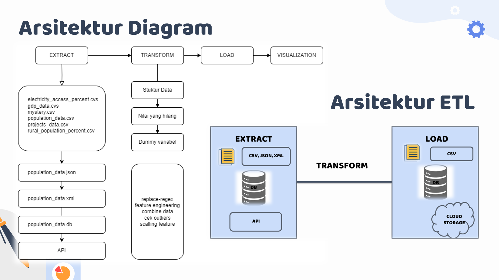

# Pengembangan Pipeline ETL & Visualisasi Data untuk Proyek Bank Dunia

## About Project
Merupakan implementasi proses ETL (Extract, Transform, Load) dari hasil kegiatan Studi Independen.
Pada proyek ini akan dilakukan pembersihkan kumpulan data dan menggabungkannya menjadi satu tabel yang nantinya bisa digunakan untuk menjalankan model prediksi biaya total proyek Bank Dunia.

## Tech Stacks
Daftar tools dan framework yang digunakan :

Tools:
- Visual Studio Code
- Jupyter Notebook
- Github

Frameworks:
import pandas as pd
import requests
import sqlite3
from bs4 import BeautifulSoup
from IPython.display import display 
from sklearn.preprocessing import StandardScaler

## Architecture Diagram

## Setup 
Untuk menggunakan project ini dilokal, lakukan langkah-langkah berikut:
- Clone repository proyek dari GitHub atau mengunduh zip
- Masuk ke teks editor untuk membuka proyek dan unduh dependensi yang di perlukan
- Lalu jalankan proyek ETL